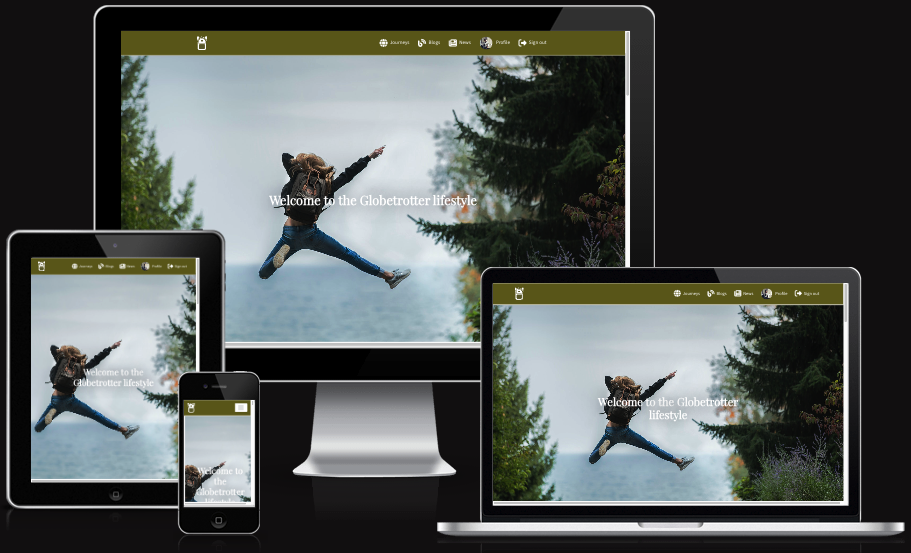
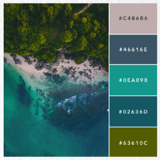
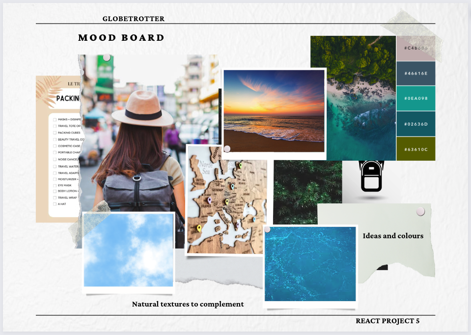
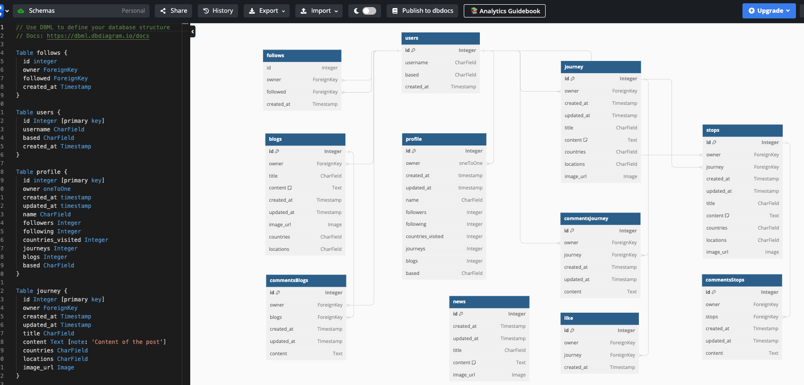
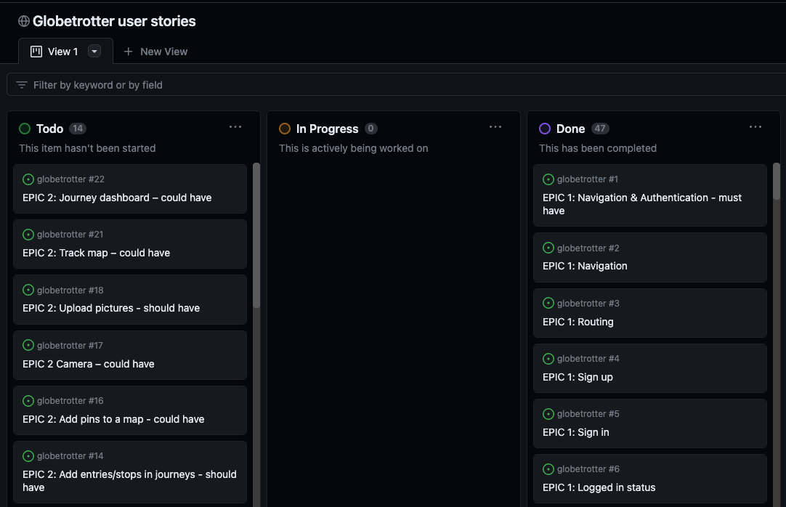
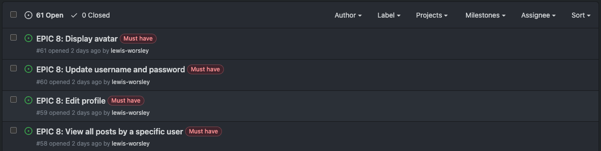

# Globetrotters
Globetrotters is a social media platform designed for travellers across the globe, to log and share their journeys (and blogs) with like-minded people. Globetrotters is dedicated to providing a space where users can freely post about their experiences in every country and every continent, whether it be backpacking, city breaks, adventures, roadtrips, family trips, activities and more. 

Globetrotters servers as a front-end component which is connected to the globetrotter-drf-api backend, developed using Django Rest Framework.

 

## Contents

[Planning & Development](https://github.com/lewis-worsley/globetrotter/blob/main/README.md#planning--development)

[Features](https://github.com/lewis-worsley/globetrotter/blob/main/README.md#features)

[Components](https://github.com/lewis-worsley/globetrotter/blob/main/README.md#components)

[Defensive Design](https://github.com/lewis-worsley/globetrotter/blob/main/README.md#defensive-design)

[Testing](https://github.com/lewis-worsley/globetrotter/blob/main/README.md#testing)

[Deployment](https://github.com/lewis-worsley/globetrotter/blob/main/README.md#deployment)

[Languages](https://github.com/lewis-worsley/globetrotter/blob/main/README.md#languages)

[Software](https://github.com/lewis-worsley/globetrotter/blob/main/README.md#software)

[Media](https://github.com/lewis-worsley/globetrotter/blob/main/README.md#media)

[Credits](https://github.com/lewis-worsley/globetrotter/blob/main/README.md#credits)

 

## Planning & Development

Popular social media platforms like X (Twitter), Facebook, Instagram, and TikTok are used in various ways for users to share any topic or interest, including travelling, which features heavily on Instagram and TikTok as pictures and videos are their primary source of interaction with the user. Globetrotters aims to created a dedicated space to only travel related content - to be the number one space where users can post detailed journeys and blogs. Furthermore, the app aims to share recent global news and guides for every country so users and non users are kept informed and educated about what's happening in the world.

 

### Site Objective

Globetrotters is a social media platform aimed for any type of traveller who wishes to log and share their experience with fellow travellers and non users of the application.
 
 
It's a consumption application for users and non users to read, inform, educate and enjoy. The aim is to convert as many people who love travelling to sign up to the website and post their journeys and blogs, whether they're frequent flyers or holiday once a year.
 
 
In summary, the site is to:

- allow visitors to read journeys, blogs and news, as well as profiles
- display a user's journeys and blogs on their profile page
- offer a seemless experience as users navigate across the app
- allow visitors to sign up and sign in
- provide users to perform CRUD functionality (create, read, update and delete) with their journeys and blogs
- deliver a colourful experience which represents travel and provokes positive emotions
- connect with the globetrotter-drf-api to store and provide data to the user
- ensure the purpose of the app is clearly demonstrated to the user, demonstration the mission and vision of Globetrotters
- provide authenticated users the opportunity to engage with journeys and blogs by liking and commenting
- offer users of the app the opportunity to add a personal bio and their country home
- give users the ability to filter results by search

 

### Target Audience

The website is designed to attract all types of travellers, but with a major focus on ages 18-45:

- Univerity students
- Young adults
- Frequent flyers
- Backpackers
- Holiday-goers

Equally, the website can also be used by families to post about their experiences.

Globetrotters is a platform for anyone looking for inspiration, interested in travelling, and/or wish to be kept up-to-date with the news around the globe.

 

### User Stories 

User stories for admin:

- As a Site Admin, I'd like to be able to create, read, update and delete news so that the website remains up-to-date
- As a Site Admin, I'd like to be able to restrict access and redirect unauthorised visitors to pages they're not permitted to see

User stories for an authenticated user:

- As a user, I'd like to be able to create, update, read and delete journeys and blogs
- As a user, I'd like to be able edit my profile, including updating my username and password
- As a user, I'd like to be able to see all my journeys and blogs on my profile page
- As a user, I'd like to be able to follow or unfollow other accounts
- As a user, I'd like to be able to have an enjoyable experience on the page, including easy navigation
- As a user, I'd like to be able to sign in and out of my account

User stories for a non authenticated user:

- As a visitor, I'd like to be able to view the latest journeys, blogs and news
- As a visitor, I'd like to be able to view profiles
- As a visitor, I'd like to be able to search for journeys, blogs and news
- As a visitor, I'd like to be able to create an account and sign in
- As a visitor, I'd like to be able to have an enjoyable experience on the page, including easy navigation

 

### Colour Scheme

The brand has a five colour palette. Green was selected as the primary colour because it evokes positives emotions such as safe, tranquil, prosperity and knowledge, as well as symbolises life, health, nature and balance. It's the colour that is associated with nature. When we see green, people think of grass, trees, forests and woodland environments, so it naturally links to life and growth. Green is believed to have calming and relaxing influnces due to its connection to nature.

The colour palette was inspired by the following picture:

 

- Grey: not used
- Grey Blue: #023C62
- Teal: #0EA098
- Blue: #02636D
- Green: #63610C

Bootstrap dark background colour (#212529) was adopted for text, card, and footer to provide effective contrast.

Page background was set to #F5F5F5.

 

### Typography

The following font pair was used imported from Google Fonts:

- Headings: Playfair Display - a transtional design, featured on more than 4,300,000 websites
- Body: Source Sans 3 - open source typefac family, intended to work well in user interfaces. Featured on more than 20,000 websites

 

### Wireframes

I used Miro to help create a medium-fedility prototype/wireframe to assist my design create for Globetrotters. By creating pages I could understand how navigation would work for users and what the feel and look would represent to visitors and users. 

 

### Moodboard

To help inspire my design I created a moodbood on Canva to ensure I was creating a website which reflected aspects of travelling

 

### Database Schema

The application I used to draw my database schema was DBDiagram to help visualise how the models will look and operate in the backend

 

### Agile Methodology

 A kanban board on GitHub was used as an agile tool for the planning and development of Globetrotters. To view it, please click [here](https://github.com/lewis-worsley/projects/4).

 

In total, the project consisted of eight epics which are referenced and linked to user stories on the kanban board:

 1. Navigation & Authentication
 2. Journeys
 3. Feed
 4. Comments
 5. Tag
 6. Blogs
 7. News
 8. Profile

 

#### MoSCoW

The MoSCoW prioritisation technique was used as an agile work method for this project. To help priortise epics, and therefore subsequently user stories, three categories were definied:

- must-have
- should-have
- could-have

 

A project board was used to create epics and user stories by using the 'Issues' function. To view them, please click [here](https://github.com/lewis-worsley/globetrotter/issues).

 

## Features

All contents on the website is restricted into a Container tag to give plenty of space and margin to the width of the webpage. All components displayed on the website are provided by React-Bootstrap.

Journeys, blogs and news each have their own unique colour associated with them and this is reflected in the headings, background colour header and buttons.

- Headings: [here](https://github.com/lewis-worsley/globetrotter/blob/main/docs/features/colour-heading.png)
- Background colour header: [here](https://github.com/lewis-worsley/globetrotter/blob/main/docs/features/background-colour-heading.png)
- Buttons: [here](https://github.com/lewis-worsley/globetrotter/blob/main/docs/features/colour-button.png)

 

### Permanent features

The following features are permanently visible across all pages to provide ease of use and navigation for visitors. 

 

#### Navigation bar

​The NavBar operates conditional rendering based on whether a user is signed in or out of their account. The NavBar is sticky so the user always has navigation available regardless of their position on the page.

Here is how the NavBar appears based on conditional rendering:

- Signed out: [here](https://github.com/lewis-worsley/globetrotter/blob/main/docs/features/navbar/signed-out.png)
- Signed in: [here](https://github.com/lewis-worsley/globetrotter/blob/main/docs/features/navbar/signed-in.png)
- Signed out (mobile): [here](https://github.com/lewis-worsley/globetrotter/blob/main/docs/features/navbar/signed-out-mobile.png)
- Signed in (mobile): [here](https://github.com/lewis-worsley/globetrotter/blob/main/docs/features/navbar/signed-in-mobile.png)

On mobile, if a user clicks on a navlink (tab), the user is pushed to that page and the navbar toggle closes. If a user opens the toggle but then clicks outside of the nav, the navbar toggle is closed.

The logo is a permanent fixture regardless of condition and pushes the user to the homepage when clicked.

 

#### Footer

​The Footer operates conditional rendering based on whether a user is signed in or out of their account. On smaller screens text is pushed to the centre.

If a user is signed in, a link to their profile account is displayed. If signed out they are presented with sign in and sign up links.

- Signed out: [here](https://github.com/lewis-worsley/globetrotter/blob/main/docs/features/footer/footer-signed-out.png)
- Signed in: [here](https://github.com/lewis-worsley/globetrotter/blob/main/docs/features/footer/footer-signed-in.png)
- Mobile: [here](https://github.com/lewis-worsley/globetrotter/blob/main/docs/features/footer/footer-mobile.png)

Future development: include company social media and contact details.

 

### Existing features

Existing features:

- Homepage
- Journeys
- Blogs
- News
- Profile

 

#### Homepage

The homepage performs conditional rendering based on whether a user is signed in or out. The homepage can be split into the following segments:

- Hero image
- About
- Journeys ("Why be a Globetrotter?")
- Blogs
- News

 

##### Hero image

As a Globetrotters is a social media platform hoping to attract as many sign ups as possible from their target audience, a welcoming message is presented to the user.

- Desktop view: [here](https://github.com/lewis-worsley/globetrotter/blob/main/docs/features/homepage/hero.png)
- Mobile view: [here](https://github.com/lewis-worsley/globetrotter/blob/main/docs/features/homepage/hero-mobile.png)

Future development: fix the title margin on smaller screens and include a scroll icon as there is no apparent call-to-action (CTA) visible. This could potentially be offset by introducing a compelling video for engagement.

 

##### About

The about section provides a short blurb to communicate with visitors about the existence of Globetrotters and it's vision.

On mobile view, the logo disappears to help condense the page.

- Desktop view: [here](https://github.com/lewis-worsley/globetrotter/blob/main/docs/features/homepage/about.png)
- Mobile view: [here](https://github.com/lewis-worsley/globetrotter/blob/main/docs/features/homepage/about-mobile.png)

 

##### Journeys

A small blurb is included to encourage users to create an account or sign in if logged out by providing two CTAs: Sign up or Sign in. Sign up button is giving better visual treatment as previous users should, in theory, be familiar with the layout of the website.

On mobile view, the image disappears to help condense the page.

- Desktop view - signed out: [here](https://github.com/lewis-worsley/globetrotter/blob/main/docs/features/homepage/journeys-signed-out.png)
- Desktop view - signed in: [here](https://github.com/lewis-worsley/globetrotter/blob/main/docs/features/homepage/journeys-signed-in.png)
- Mobile view: [here](https://github.com/lewis-worsley/globetrotter/blob/main/docs/features/homepage/journeys-mobile-without-image.png)

The three latest journeys published are featured on the homepage on large and extra small screens, two on medium screens, and one on small screens. This is because the React component CardDeck causes the content to lose it's format on screens smaller than large or screens bigger than extra small.

Conditional rendering is added to the button underneath the cards whether a user is logged in or not.

- Signed out: [here](https://github.com/lewis-worsley/globetrotter/blob/main/docs/features/homepage/journeys-signed-out-button-cta.png)
- Signed in: [here](https://github.com/lewis-worsley/globetrotter/blob/main/docs/features/homepage/journeys-signed-in-button-cta.png)

 

##### Blogs

The three latest blogs published are featured on the homepage on large and extra small screens, two on medium screens, and one on small screens. This is because the React component CardDeck causes the content to lose it's format on screens smaller than large or screens bigger than extra small.

The button has no conditional rendering - pushes users to the blogs page.

- Desktop view: [here](https://github.com/lewis-worsley/globetrotter/blob/main/docs/features/homepage/blogs.png)
- Mobile view: [here](https://github.com/lewis-worsley/globetrotter/blob/main/docs/features/homepage/blogs-mobile.png)

 

##### News

The three latest news published are featured on the homepage on large and extra small screens, two on medium screens, and one on small screens. This is because the React component CardDeck causes the content to lose it's format on screens smaller than large or screens bigger than extra small.

The button has no conditional rendering - pushes users to the news page.

- Desktop view: [here](https://github.com/lewis-worsley/globetrotter/blob/main/docs/features/homepage/news.png)
- Mobile view: [here](https://github.com/lewis-worsley/globetrotter/blob/main/docs/features/homepage/news-mobile.png)

 

#### Authentication

Users are presented with an option to either sign up or sign when on the webpage. If a user is logged in and proceeds to visit one of the following pages, they're redirected back to the homepage.

If there is an error on the form, a user is presented with an error message.

- Sign up error example: [here](https://github.com/lewis-worsley/globetrotter/blob/main/docs/features/auth/signup-error.png)
- Sign in error example: [here](https://github.com/lewis-worsley/globetrotter/blob/main/docs/features/auth/signin-error.png)

When a user successfully creates an account via the sign up page, they're then redirected to the sign in page to sign in.

 

##### Sign up

Screens smaller than large (≥992px), the image is removed.

- Desktop view: [here](https://github.com/lewis-worsley/globetrotter/blob/main/docs/features/auth/signup.png)
- Mobile view: [here](https://github.com/lewis-worsley/globetrotter/blob/main/docs/features/auth/signup-mobile.png)

 

##### Sign in

Screens smaller than large (≥992px), the image is removed.

- Desktop view: [here](https://github.com/lewis-worsley/globetrotter/blob/main/docs/features/auth/signin.png)
- Mobile view: [here](https://github.com/lewis-worsley/globetrotter/blob/main/docs/features/auth/signin-mobile.png)

 

#### Journeys

Adopted colour theme for journeys: Green #63610C

All journeys are published on the journeys page but this component can also be found on the blogs, news and homepage pages but as a smaller section on those pages respectively.

See example: [here](https://github.com/lewis-worsley/globetrotter/blob/main/docs/features/journeys/journeys-small-component.png)

To ensure users are able to establish the difference between journeys, blogs and news, the colour card header background inherits a green colour.

The information is placed in a React Card component for structural and content purposes.

The card features:

- heading
- content
- read more...
- like count
- comment count
- CTA

If a user clicks the heading, read more..., comment count, or CTA they are directed to the unique journey page. Authenticated users can like a journey without viewing the unique page.

- See example: [here](https://github.com/lewis-worsley/globetrotter/blob/main/docs/features/journeys/journey-card.png)

The search query is available to use on all screens.

- Search query: [here](https://github.com/lewis-worsley/globetrotter/blob/main/docs/features/journeys/journey-search-query.png)

If a user is signed in, a button appears above the search query for users to create a journey which directs them to an appropriate form.

- Button for signed in users: [here](https://github.com/lewis-worsley/globetrotter/blob/main/docs/features/journeys/journey-create-button.png)

On screens smaller than large (≥992px), all other components on the page are hidden.

Image height cannot exceed image width but can be equal. However across all journey components width is greater than height to ensure a format that is close to a 16:9 screen on all devices.

Infinite scroll component has been implemented to display further journeys published if the user goes on to scroll past more than 10 journeys.

 

#### Blogs

Adopted colour theme for blogs: Blue #02636D

All blogs are published on the blogs page but this component can also be found on the journeys, news and homepage pages but as a smaller section on those pages respectively.

See example: [here](https://github.com/lewis-worsley/globetrotter/blob/main/docs/features/blogs/blogs-small-component.png)

To ensure users are able to establish the difference between journeys, blogs and news, the colour card header background inherits a blue colour.

The information is placed in a React Card component for structural and content purposes.

The card features:

- heading
- content
- read more...
- like count
- comment count
- CTA

If a user clicks the heading, read more..., comment count, or CTA they are directed to the unique blogs page. Authenticated users can like a blog without viewing the unique page.

- See example: [here](https://github.com/lewis-worsley/globetrotter/blob/main/docs/features/blogs/blogs-card.png)

The search query is available to use on all screens.

- Search query: [here](https://github.com/lewis-worsley/globetrotter/blob/main/docs/features/blogs/blogs-search-query.png)

If a user is signed in, a button appears above the search query for users to create a blog which directs them to an appropriate form.

- Button for signed in users: [here](https://github.com/lewis-worsley/globetrotter/blob/main/docs/features/blogs/blogs-create-button.png)

On screens smaller than large (≥992px), all other components on the page are hidden.

Image height cannot exceed image width but can be equal. However across all blog components width is greater than height to ensure a format that is close to a 16:9 screen on all devices.

Infinite scroll component has been implemented to display further blogs published if the user goes on to scroll past more than 10 blogs.

 

#### News

Adopted colour theme for news: Grey Blue #023C62

All news are published on the news page but this component can also be found on the journeys, blogs and homepage pages but as a smaller section on those pages respectively.

See example: [here](https://github.com/lewis-worsley/globetrotter/blob/main/docs/features/news/news-small-component.png)

To ensure users are able to establish the difference between news, blogs and news, the colour card header background inherits a grey blue colour.

The information is placed in a React Card component for structural and content purposes.

The card features:

- heading
- content
- read more...
- CTA

If a user clicks the heading, read more..., comment count, or CTA they are directed to the unique news page. There is no like or comment function for news.

- See example: [here](https://github.com/lewis-worsley/globetrotter/blob/main/docs/features/news/news-card.png)

The search query is available to use on all screens.

- Search query: [here](https://github.com/lewis-worsley/globetrotter/blob/main/docs/features/news/news-search-query.png)

A news article cannot be created by non and authenticated users, only by admin.

On screens smaller than large (≥992px), all other components on the page are hidden.

Image height cannot exceed image width but can be equal. However across all news components width is greater than height to ensure a format that is close to a 16:9 screen on all devices.

Infinite scroll component has been implemented to display further news published if the user goes on to scroll past more than 10 news.

 

#### Unique (id) pages

Each journey, blog and news article, has their own unique (id) page - news comes without likes and comments, as well as no ability to edit the content for non and authenticated users. The following example in the links below is demonstrated by a journey post.

Journey example:
-  [first part](https://github.com/lewis-worsley/globetrotter/blob/main/docs/features/unique-pages/journey-first.png)
-  [second part](https://github.com/lewis-worsley/globetrotter/blob/main/docs/features/unique-pages/journey-second.png)
-  [third part](https://github.com/lewis-worsley/globetrotter/blob/main/docs/features/unique-pages/journey-third.png)

If the owner owns the unique page, three dots appear in the right top column of the Card component for them to be able to edit or delete the journey or blog. If the user doesn't own the unique page, they cannot edit nor delete it.

A user cannot like their own material but can comment - a ToolTip component is used to notify the owner. A non authenticated user is notified to login to like posts. The owner of the unique page can't like their posts which they're informed by a Tooltip.

- ToolTip: can't like own posts: [here](https://github.com/lewis-worsley/globetrotter/blob/main/docs/features/unique-pages/tooltip-cant-like-own-post.png)
- ToolTip: login to like posts: [here](https://github.com/lewis-worsley/globetrotter/blob/main/docs/features/unique-pages/tooltip-login-to-like-posts.png)

The image that is uploaded by the user on a form appears as the hero image on the unique page.

Comments that are published show the associated profile image and owner. The comment form is removed for non authenticated users.

The like and comment icons have a count number to register how many users and comment a given post.

Future development: 
- install and deploy a use rich text editor for users to be able to format their content how they wish. At the moment, text content is not easy to read as there is spacing between paragraphs nor subheadings
- page doesn't always refresh after a comment or like is submitted so the plan would be to fix that error from occuring
- add a tooltip to comments to notify users to login to comment
- add a map api for journeys

 

#### Form pages

Journeys and blogs both have form pages for authenticated users to submit posts - for users who are not logged in and try to enter they're redirected to the homepage.

The format and fields are the same for both respective components.

- See journey form page example: [here](https://github.com/lewis-worsley/globetrotter/blob/main/docs/features/form-pages/form-page-journey.png)

Error messages are highlighted to the user if an image and or text is missing from one or all of the fields.

- Error message: [here](https://github.com/lewis-worsley/globetrotter/blob/main/docs/features/form-pages/form-page-error-messages.png)

The upload image in the form was provided by Code Institute.

 

##### Edit forms

A authenticated and owner of a post can edit their posts.

- See journey form page example: [here](https://github.com/lewis-worsley/globetrotter/blob/main/docs/features/form-pages/form-page-edit.png)

Future development: a blog may not have a country associated with it, for example, it could be about hotels or hostels, parks, hobbies, costs etc. A separate field would need to be created.

 

#### Profile

A user can view their own profile by clicking on the profile link in the navbar or by clicking "Profile Account" in the footer.

- Profile page: [here](https://github.com/lewis-worsley/globetrotter/blob/main/docs/features/profile/profile-page.png)

Alternatively, they can click on their own avatar when it appears across the site, for example, on a post or comment. 

For non users and users of the website, clicking on any profile avatar or profile name will show the profile page for that particular user which displays their:

- name
- bio
- country base
- journey count
- blog count
- followers
- following
- journeys
- blogs

Profile intro: [here](https://github.com/lewis-worsley/globetrotter/blob/main/docs/features/profile/profile-intro.png)

When visiting a profile page, the visitor is presented with a React Tabs component underneath the profile intro: journeys and blogs. The purpose of this is prevent the profile page having a long path length if they've posted many journeys, blogs or both. It is presented in a grid like manner to emulate previous popular designs such like Instagram and TikTok.

Profile grid: 

- Journey tab: [here](https://github.com/lewis-worsley/globetrotter/blob/main/docs/features/profile/profile-journeys.png)
- Blogs tab: [here](https://github.com/lewis-worsley/globetrotter/blob/main/docs/features/profile/profile-blogs.png)

On screens smaller than large (≥992px), text is moved to the center to accommodate all the content on the profile page.

- Mobile view: [here](https://github.com/lewis-worsley/globetrotter/blob/main/docs/features/profile/profile-mobile.png)

Future developments: fix React CardDeck format for screens smaller than Large and bigger than extra small

 

##### Profile edits

Profile owners have the ability to edit their own profiles by clicking on the three dots on the top right corner of their profile intro.

Upon clicking the three dots, they're presented with three options

1. edit profile
2. change username
3. change password

- Three options: [here](https://github.com/lewis-worsley/globetrotter/blob/main/docs/features/profile/profile-three-options.png)

Users can edit their profiles: [here](https://github.com/lewis-worsley/globetrotter/blob/main/docs/features/profile/profile-edit-profile.png)

Users can change their username: [here](https://github.com/lewis-worsley/globetrotter/blob/main/docs/features/profile/profile-change-username.png)

Users can change their password: [here](https://github.com/lewis-worsley/globetrotter/blob/main/docs/features/profile/profile-change-password.png)

 

##### Suggestions to follow

A popular profiles component is present on the journeys, blogs and news page feeds, but on smaller screens less than large, the component is hidden.

The idea is to encourage users to follow accounts who are active on the site.

If the user is signed out, the follow button feature is removed. On the other hand, if the user is signed in, the follow/unfollow button is displayed.

- Signed out: [here](https://github.com/lewis-worsley/globetrotter/blob/main/docs/features/profile/profile-suggestions-to-follow-signed-out.png)
- Signed in: [here](https://github.com/lewis-worsley/globetrotter/blob/main/docs/features/profile/profile-suggestions-to-follow-signed-in.png)

 

## Components

Several components are reused throughout the project:

- Asset.js is used to integrate the user Avatar in the navbar, profile, journey and blogs pages. It is also used in the comments. Asset.js also supplies the loading animation

- axiosDefaults.js is a simple file created to assist with communication with the back-end API

- CurrentUserContext.js is used to confirm users' logged-in status and what functionality they are permitted

- DropdownMenu.js is used to allow users to edit profiles, journeys, blogs and comments

- Navbar.js to provide an easy way to navigate the site

- ProfileDataContext provides follow and un-follow functionality across the site

- useRedirect.js redirects users to other pages of they are not authorised to view the page they are trying to access

- utils.js is used to provide the infinite scroll functionality

- Footer.js is used to signify the end of the page on each page of the website. Along with the navbar it also provides navigation

 

## Defensive design

The website needs to have defensive measure inputted to protect its credibility.

 

### User authentication

All pages that are associated with creating or editing forms are protected by user authentication. Furthermore, users can edit or delete another post they do not own.

The useRedirect hook is used to prevent signed out users from entering pages they should not have access to.

 

### 404 page

To signify to users they are on a wrong URL page, a 404 page has been created. This notifies the user they should move on from this page as the URL page doesn't exist.

404 error: [here](https://github.com/lewis-worsley/globetrotter/blob/main/docs/features/defensive-design/404-error.png)

 

## Testing

Throughout the build of the website, but more so after the structure and contents of the page was added, Google Dev-tools was used extensively to validate new ideas, fix errors, unearth solutions, styles, and ensure consistency with the design and user experience across various devices by ensuring the website was responsive.

The testing process, along with bugs, can be viewed [here](https://github.com/lewis-worsley/moments/blob/main/TESTING.md).

 

### Am I responsive

To check to see if the website was responsive across different types of devices, the URL was entered into https://ui.dev/amiresponsive/. The website appeared as expected across each device. The image snippet in the intro section of this README.md is provided by Am I Responsive?

 

### Testing on devices

During development of the website, the code was written and tested on MacBook Pro 14", LG 21.5" monitor, and Samsung 18" monitor - all of the screenshots in this README.md file have been captured on the MacBook Pro.

Google Chrome was used as the browser for writing the code for this project.

Google Dev-tools was used extensively throughout the process, as it provides instant feedback on appearance and responsivity across elements and dimensions.

After development, the website has been tested on the following devices:

- MacBook Pro 14"
- Samsung 18" monitor
- LG 21.5" monitor
- iPhone XS Max - Chrome and Safari

 

### Validator testing

The three websites used to validate the code are:

- HTML: https://validator.w3.org/
- CSS: https://jigsaw.w3.org/css-validator/
- Python: https://pep8ci.herokuapp.com/
- Javascript: https://jshint.com/

For accessibility, the following Chrome extensions was used:

- Lighthouse

 

#### Testing report

- HTML:
- CSS: no existing errors reported
- Python: no existing errors reported
- Javascript: warnings reported, however they do not effect the functionality of the website. See link below for example:

Javascript example for MoreDropdown.js component: [here](https://github.com/lewis-worsley/globetrotter/blob/main/docs/features/testing/jshint.png)

 

#### Lighthouse

Lighthouse has reported fairly positive metrics (see graphic below) with scores ranging from 82 to 93, but it shows there are signs of improvements for the website.

Lighthouse score: [here](https://github.com/lewis-worsley/globetrotter/blob/main/docs/features/testing/lighthouse.png)

 

## Deployment

This application was deployed through and connected to the globetrotter-drf-api 

 

### Initial deployment

I took the following steps to deploy the site to Heroku as early as possible, and have listed any console commands required to initiate it. My aim was to ensure this process was completed as early as possible in the project, to avoid complications or issues as it progressed.

### Create repository:

*  Create a new repository in GitHub based on [this](https://github.com/Code-Institute-Org/react-ci-template/generate) template from Code Institute.

 

### Setting up the Workspace (To be done locally via the console of your chosen editor)

* Enter `npm install` in the terminal and wait for all packages to install. This will install all dependencies required for the project.

 

### Deploying the App to heroku

 

#### Create Heroku App:

The below works on the assumption that you already have an account with [Heroku](https://id.heroku.com/login) and are already signed in.

1. Create a new Heroku app:
    - Click "New" in the top right-hand corner of the landing page, then click "Create new app."
1. Give the app a unique name:
    - It will form part of the URL (in the case of this project, I called the Heroku app "globetrotters")
1. Select the nearest location:
    - For me, this was Europe.
1. Connect to GitHub:
    - From the deploy tab, click on "GitHub" in the "Deployment Method" section.
    - Enter the name of the repository and click "connect".
    - Click "deploy branch".

 

#### Connect to the API

1. In *Heroku globetrotter-drf-api*:
    * In the settings tab, add new config vars:
    - Key: CLIENT_ORIGIN, Value: https://globetrotters-17c2ffb8496e.herokuapp.com
    - Key: CLIENT_ORIGIN_DEV, Value: https://3000-lewisworsle-globetrotte-4fsv6xvyklj.ws-eu104.gitpod.io
    * *IMPORTANT:* remove trailing slash at the end of each link.
    * Install the Axios package and create axiosDefaults.js in api folder.
    - In *axiosDefaults.js*, set baseURL, content-type header, withCredentials.
    - Import axiosDefaults in *App.js*.

 

### Final Deployment

In *package.json* file, in the “scripts” section, add the following prebuild command: `"heroku-prebuild": "npm install -g serve"`

This will install a package needed to serve the single page application on heroku.

Add a *Procfile* at the root of the project with the following web command: `web: serve -s build`

 

## Languages & Frameworks and other technologies

- HTML
- CSS
- Javascript
- Python
- Django Rest Framework
- React
- React-Bootstrap
- ElephantSQL
- Heroku
- Cloudinary

 

## Software

The logo for Globetrotters was inspired by a google search for "backpacks". It was created via Adobe Creative Cloud Suite; more specifically I used:

- Adobe Illustrator

 

## Media

- Images were sourced from pexels.com
- Icons were sourced from Font Awesome
- No Results image was provided by Code Institute
- Fonts provided by Google Fonts

 

## Credits

To help bring this project to life, the following deserve recognition:

 

### Content

- Stack Overflow for providing answers to errors discovered during the project and implementing new ideas such as extending the background colour beyond Container with CSS: https://stackoverflow.com/questions/22083157/extend-background-color-of-header-beyond-container-with-css
- Geek for Geeks for providing me a solution to implement a ReadMore component: https://www.geeksforgeeks.org/how-to-create-a-read-more-component-in-reactjs/
- gomakethings.com for teaching me how to make an image extend out Container via CSS: https://gomakethings.com/how-to-break-an-image-out-of-its-parent-container-with-css/

 

### Thanks

- Richard Wells (mentor)
    - With his help and guidance I was able to successfully build a project I'm proud of which including building the back and front ends

- Code Institute
    - The Moments walkthrough project provided me with the tools to tackle this challenge by providing a strong foundation and template to work from
    - The support team for helping me fix any bugs and errors in my code