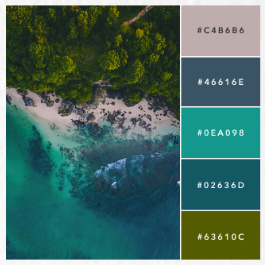
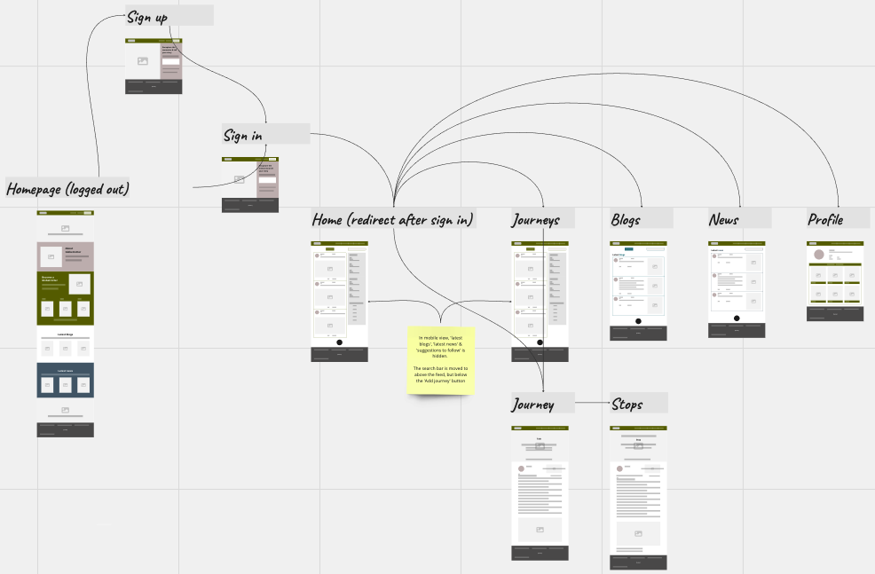
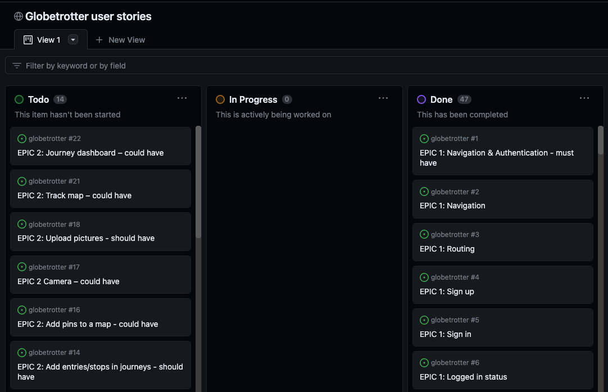
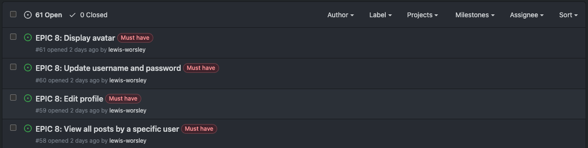

# Globetrotters
Globetrotters is a social media platform designed for travellers across the globe, to log and share their journeys (and blogs) with like-minded people. Globetrotters is dedicated to providing a space where users can freely post about their experiences in every country and every continent, whether it be backpacking, city breaks, adventures, roadtrips, family trips, activities and more. 

Globetrotters servers as a front-end component which is connected to the globetrotter-drf-api backend, developed using Django Rest Framework.

 

## Contents

[Planning & Development](https://github.com/lewis-worsley/globetrotter/blob/main/README.md#planning--development)

[Features](https://github.com/lewis-worsley/globetrotter/blob/main/README.md#features)

[Testing](https://github.com/lewis-worsley/globetrotter/blob/main/README.md#testing)

[Deployment](https://github.com/lewis-worsley/globetrotter/blob/main/README.md#deployment)

[Languages](https://github.com/lewis-worsley/globetrotter/blob/main/README.md#languages)

[Software](https://github.com/lewis-worsley/globetrotter/blob/main/README.md#software)

[Media](https://github.com/lewis-worsley/globetrotter/blob/main/README.md#media)

[Credits](https://github.com/lewis-worsley/globetrotter/blob/main/README.md#credits)

 

## Planning & Development

Popular social media platforms like X (Twitter), Facebook, Instagram, and TikTok are used in various ways for users to share any topic or interest, including travelling, which features heavily on Instagram and TikTok as pictures and videos are their primary source of interaction with the user. Globetrotters aims to created a dedicated space to only travel related content - to be the number one space where users can post detailed journeys and blogs. Furthermore, the app aims to share recent global news and guides for every country so users and non users are kept informed and educated about what's happening in the world.

 

### Site Objective

Globetrotters is a social media platform aimed for any type of traveller who wishes to log and share their experience with fellow travellers and non users of the application.
 
 
It's a consumption application for users and non users to read, inform, educate and enjoy. The aim is to convert as many people who love travelling to sign up to the website and post their journeys and blogs, whether they're frequent flyers or holiday once a year.
 
 
In summary, the site is to:

- allow visitors to read journeys, blogs and news, as well as profiles
- display a user's journeys and blogs on their profile page
- offer a seemless experience as users navigate across the app
- allow visitors to sign up and sign in
- provide users to perform CRUD functionality (create, read, update and delete) with their journeys and blogs
- deliver a colourful experience which represents travel and provokes positive emotions
- connect with the globetrotter-drf-api to store and provide data to the user
- ensure the purpose of the app is clearly demonstrated to the user, demonstration the mission and vision of Globetrotters
- provide authenticated users the opportunity to engage with journeys and blogs by liking and commenting
- offer users of the app the opportunity to add a personal bio and their country home
- give users the ability to filter results by search

 

### Target Audience

The website is designed to attract all types of travellers, but with a major focus on ages 18-45:

- Univerity students
- Young adults
- Frequent flyers
- Backpackers
- Holiday-goers

Equally, the website can also be used by families to post about their experiences.

Globetrotters is a platform for anyone looking for inspiration, interested in travelling, and/or wish to be kept up-to-date with the news around the globe.

 

### User Stories 

User stories for admin:

- As a Site Admin, I'd like to be able to create, read, update and delete news so that the website remains up-to-date
- As a Site Admin, I'd like to be able to restrict access and redirect unauthorised visitors to pages they're not permitted to see

User stories for an authenticated user:

- As a user, I'd like to be able to create, update, read and delete journeys and blogs
- As a user, I'd like to be able edit my profile, including updating my username and password
- As a user, I'd like to be able to see all my journeys and blogs on my profile page
- As a user, I'd like to be able to follow or unfollow other accounts
- As a user, I'd like to be able to have an enjoyable experience on the page, including easy navigation
- As a user, I'd like to be able to sign in and out of my account

User stories for a non authenticated user:

- As a visitor, I'd like to be able to view the latest journeys, blogs and news
- As a visitor, I'd like to be able to view profiles
- As a visitor, I'd like to be able to search for journeys, blogs and news
- As a visitor, I'd like to be able to create an account and sign in
- As a visitor, I'd like to be able to have an enjoyable experience on the page, including easy navigation

 

### Colour Scheme

The brand has a five colour palette. Green was selected as the primary colour because it evokes positives emotions such as safe, tranquil, prosperity and knowledge, as well as symbolises life, health, nature and balance. It's the colour that is associated with nature. When we see green, people think of grass, trees, forests and woodland environments, so it naturally links to life and growth. Green is believed to have calming and relaxing influnces due to its connection to nature.

The colour palette was inspired by the following picture:

 

- Grey: not used
- Grey Blue: #023c62
- Teal: #0EA098
- Blue: #02636D
- Green: #63610C

Bootstrap dark background colour (#212529) was adopted for text, card, and footer to provide effective contrast.

Page background was set to #F5F5F5.

 

### Typography

The following font pair was used imported from Google Fonts:

- Headings: Playfair Display - a transtional design, featured on more than 4,300,000 websites
- Body: Source Sans 3 - open source typefac family, intended to work well in user interfaces. Featured on more than 20,000 websites

 

### Wireframes

I used Miro to help create a medium-fedility prototype/wireframe to assist my design create for Globetrotters. By creating pages I could understand how navigation would work for users and what the feel and look would represent to visitors and users. 

 

### Moodboard

To help inspire my design I created a moodbood on Canva to ensure I was creating a website which reflected aspects of travelling

 

### Database Schema

The application I used to draw my database schema was DBDiagram to help visualise how the models will look and operate in the backend

 

### Agile Methodology

 A kanban board on GitHub was used as an agile tool for the planning and development of Globetrotters. To view it, please click [here](https://github.com/lewis-worsley/projects/4).

 

In total, the project consisted of eight epics which are referenced and linked to user stories on the kanban board:

 1. Navigation & Authentication
 2. Journeys
 3. Feed
 4. Comments
 5. Tag
 6. Blogs
 7. News
 8. Profile

 

#### MoSCoW

The MoSCoW prioritisation technique was used as an agile work method for this project. To help priortise epics, and therefore subsequently user stories, three categories were definied:

- must-have
- should-have
- could-have

 

A project board was used to create epics and user stories by using the 'Issues' function. To view them, please click [here](https://github.com/lewis-worsley/globetrotter/issues).

## Languages & Frameworks and other technologies

- HTML
- CSS
- Javascript
- Python
- Django Rest Framework
- React
- React-Bootstrap
- ElephantSQL
- Heroku
- Cloudinary

 

## Software

The logo for Globetrotters was inspired by a google search for "backpacks". It was created via Adobe Creative Cloud Suite; more specifically I used:

- Adobe Illustrator

 

## Media

- Images were sourced from pexels.com
- Icons were sourced from Font Awesome
- No Results image was provided by Code Institute
- Fonts provided by Google Fonts

 

## Credits

To help bring this project to life, the following deserve recognition:

 

### Content

- Stack Overflow for providing answers to errors discovered during the project and implementing new ideas such as extending the background colour beyond Container with CSS: https://stackoverflow.com/questions/22083157/extend-background-color-of-header-beyond-container-with-css
- Geek for Geeks for providing me a solution to implement a ReadMore component: https://www.geeksforgeeks.org/how-to-create-a-read-more-component-in-reactjs/
- gomakethings.com for teaching me how to make an image extend out Container via CSS: https://gomakethings.com/how-to-break-an-image-out-of-its-parent-container-with-css/

 

### Thanks

- Richard Wells (mentor)
    - With his help and guidance I was able to successfully build a project I'm proud of which including building the back and front ends. 
- Code Institute
    - The Moments walkthrough project provided me with the tools to tackle this challenge by providing a strong foundation and template to work from