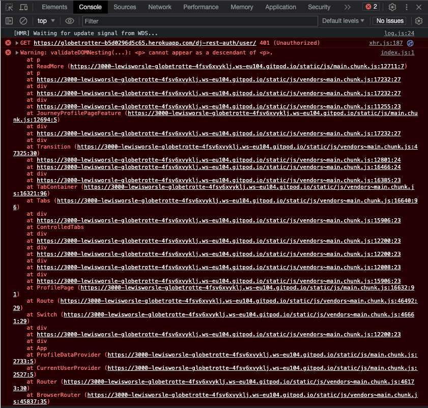
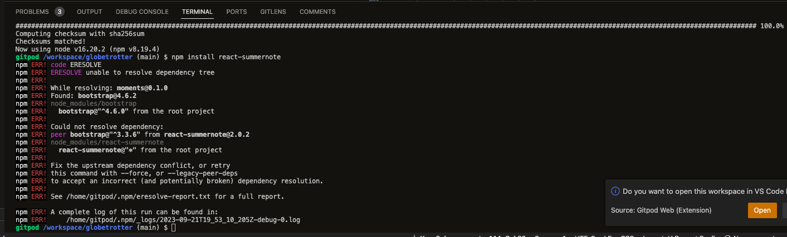
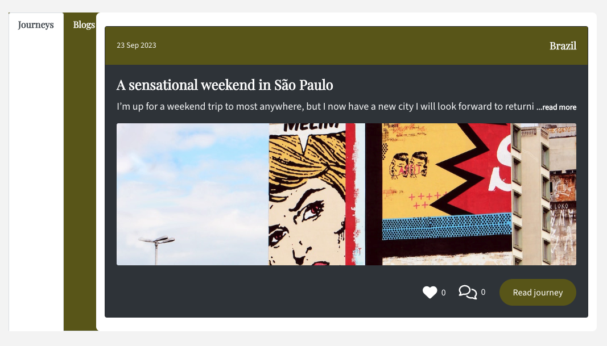
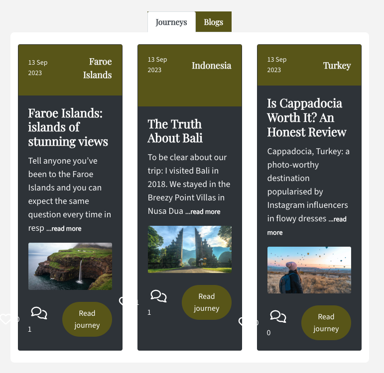
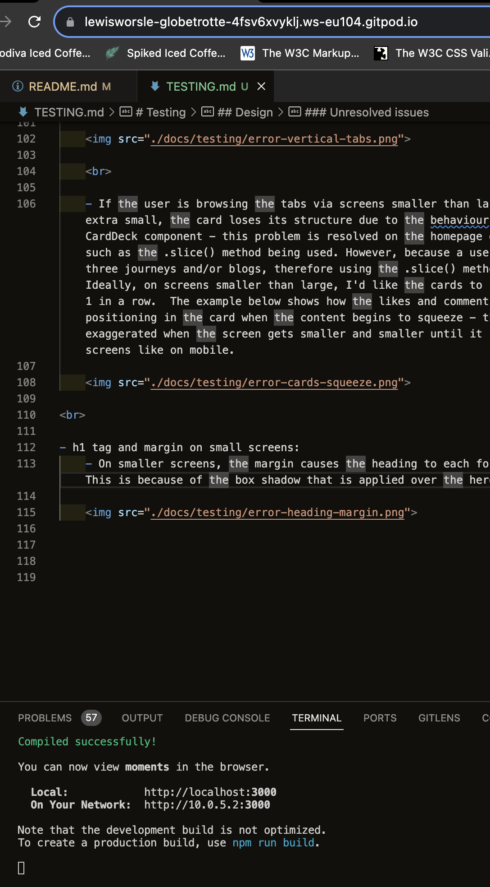

# Testing

Throughout the time of writing this project, the browsers I used to test the website were through Chrome and Safari. I tested the project on my MacBook Pro and iPhone XS Max. 

Almost of all user testing were done by myself.

All links and buttons work as expected.

Inevitably there were bugs and these are outlined and summarised below.

Full details of manual testing can be found on this page.

 

## **Bugs**

During the course of writing the code for this application, these are the following bugs I discovered.

 

### Bug fixes

​
The following bugs were identified during user testing:

- Bug 🐞 - Upon starting the workspace, an error message is displayed relating to the Node version.
- Cause ⚒️ - There is a conflict between the template and current version of Node.
- Resolution ✅ - In the terminal, enter: `nvm i 16` > `nvm use 16` > `npm start`.

 

- Bug 🐞 - Upon signing in, I was having to refresh the page to load the content
- Cause ⚒️ - data was not inputted into setCurrentUser() context
- Resolution ✅ - correct solutions lookes likes this: setCurrentUser(data)

​ 

- Bug 🐞 - The ReadMore component was throwing an error
- Cause ⚒️ - The console highlighted that the p tag cannot appear as a descendant of p tag (see image below)
- Resolution ✅ - Changed the p tags to span tags

 

- Bug 🐞 - Terminal errors when interacting with the app when signed out. Specifically:
  - 401 errors on mount when not logged in
  - 401 errors when going to the sign/sign up page
  - 401 error when an access token has expired
- Cause ⚒️ - According to the Code Institute walkthrough project, these errors are normal and should be treated as feedback from the API.
- Resolution ✅ - Whilst the errors persist, it is reassuring to know these errors can essentially be disregarded for the purpose of this project.

​ 

- Bug 🐞 - Users (not admin or staff) were able to access edit news form pages when not logged in
- Cause ⚒️ - No defensive design present on these pages
- Resolution ✅ - Removed the form pages from the site until a permanent fix is found as the useRedirect() hook was not an appropriate solution as the data couldn't identify if a profile had staff or admin permissions

 

- Bug 🐞 - Global image style was applied to all images causing some images to lose their 16:9 format
- Cause ⚒️ - Incorrect CSS styling applied to images on their respective pages
- Resolution ✅ - Created a new CSS style and applied it to pages which needed the images to be constrained to 16:9 format

 

- Bug 🐞 - Terminal: unable to resolve dependency tree
- Cause ⚒️ - Conflicting dependencies when installing react-summernote
- Resolution ✅ - Referred to this Stack Overflow [article](https://stackoverflow.com/questions/71582397/eresolve-unable-to-resolve-dependency-tree-while-installing-a-pacakge) to solve the problem. NOTE: I've since uninstalled react-summernote 

 

### Unfixed bugs

- Sign in:
    - On desktop, the user can sign in, however, on mobile, specifically on the iPhone XS Max, the same isn't possible - I've been informed from Code Institute that is a regular occurance with ReactJS projects on Apple devices

- Likes: 
    - On the journey and blogs page, the like count increasing and decreases when clicked but the like count doesn't refresh when clicked upon in the unique (id) pages, for both journeys and blogs

- Comments: 
    - On the unique journey page, the comment count doesn't refresh when a comment is added or deleted nor does the comment appear to be submitted under the post, meaning the user could spam the post button causing multiple instances of the same comment to be created. When the page is refreshed the comment appears under the card and comment count increases

- News search query:
    - The news search query field is not filtering results based on user input

 

## Design

Although all CSS stylesheets passed on https://jigsaw.w3.org/css-validator/, there are some issues unresolved, but not major as all components can still be used.

### Resolved issues

- Navbar toggle:
    -  Has a style attribute to target backgroundColor and borderColor. Targeting this through CSS proved difficult and time consuming. In future, I'd like to remove the attribute and find a way to style it via CSS

### Unresolved issues

- Profile page:
    - If a user has only posted one journey or blog, the tabs section loses it's formatting causing the tabs to appear horizontal. Unfortunately, I've not been able to find a solution to this problem. If a tab contains two or more cards, the tabs title returns to it's original horizontal position. 

    

     

    - If the user is browsing the tabs via screens smaller than large but larger than extra small, the card loses its structure due to the behaviour of the React CardDeck component - this problem is resolved on the homepage due to added logic such as the .slice() method being used. However, because a user can have more than three journeys and/or blogs, therefore using the .slice() method is impractical. Ideally, on screens smaller than large, I'd like the cards to show columns of 2 or 1 in a row.  The example below shows how the likes and comments icons loses it's positioning in the card when the content begins to squeeze - this is greatly exaggerated when the screen gets smaller and smaller until it reaches extra small screens like on mobile.

    

 

- h1 tag and margin on small screens:
    - On smaller screens, the margin causes the heading to each form their own lines. This is because of the box shadow that is applied over the hero image

    

 

## Result

There are currently warnings or error reported from the terminal.

 

## Manual testing

To ensure the application is working as expected, I performed some manual tests.

 

### Authorised user

- User story 📖: Be able to sign in to my account
- Test 🧪: When signed out, I navigated to the navbar, as well as used links and buttons that are present across the site that push vistors to the sign in page, and filled the form to sign in
- Result 🏆: Entered my details and clicked the submit button to be redirected to the  home page. In subsequent visits, the form auto-filled the sign in fields which as a user made my life easier
- Verdict ✅: Test passed

 

- User story 📖: Be able to sign out of my account
- Test 🧪: When signed in, I navigated to the navbar and clicked the sign out button
- Result 🏆: After clicking sign out, I was redirected to the homepage and the navlink changed to highlight I had indeed signed out
- Verdict ✅: Test passed

 

- User story 📖: View all my own journey and blogs on one page
- Test 🧪: I checked to ensure the owner's posts were linked to their account on the profile page
- Result 🏆: Journeys and blogs posts linked to the owner are displayed to their respective owner on their profile page
- Verdict ✅: Test passed

 

- User story 📖: Create journeys and blogs
- Test 🧪: As a signed in user, I navigated to their respective form pages and created a new post
- Result 🏆: Upon submission, I was redirected to the unique (id) post page and the post was displayed on the journey and blog list feed respectively
- Verdict ✅: Test passed

 

- User story 📖: Edit or delete my journeys and blogs
- Test 🧪: 'Edit' and 'Delete' buttons were present in a dropdown menu via the three dots icon on posts I had created. Clicked 'Edit' and 'Delete'
- Result 🏆: After submitting the edit post form I was redirected to the unique (id) post that I just edited. Upon deletion the post was removed from the site and I was redirected to the journeys or blogs page
- Verdict ✅: Test passed

 

- User story 📖: Add a comment on my own and other user's journeys and blogs
- Test 🧪: Viewed one of my own posts and another user's post
- Result 🏆: After submitting a comment, the comment was logged to the post. This worked in both cases
- Verdict ✅: Test passed

 

- User story 📖: Edit or delete my comments
- Test 🧪: 'Edit' and 'Delete' buttons were present in a dropdown menu via the three dots icon on comments I had created. Clicked 'Edit' and 'Delete'
- Result 🏆: After submitting the edit comment form, the comment showed the new changes, replacing the old comment. Upon deletion the comment was removed from the post
- Verdict ✅: Test passed

 

- User story 📖: Add to and/or update my profile
- Test 🧪: On the profile form page I updated my profile image, bio and base of country
- Result 🏆: Upon saving the form, I was redirected back to the profile page which showed my recent changes
- Verdict ✅: Test passed

 

- User story 📖: Update username and password in order to keep my account secure
- Test 🧪: On the profile Page, I selected edit username and edit password from the dropdown menu which is presented via the three dots icon
- Result 🏆: Username and password were updated accordingly and this was confirmed when signing in with the new details
- Verdict ✅: Test passed

 

- User story 📖: Sign out of my account
- Test 🧪: Clicked on the sign out button in the navbar
- Result 🏆: After clicking the sign out button, I was redirected to the homepage and signed out - the navbar now displays options to sign in or sign up
- Verdict ✅: Test passed

 

- User story 📖: Follow or unfollow other users
- Test 🧪: Visited multiple profile accounts and clicked the follow and unfollow buttons. I also tested out the feature for the 'Suggestions to follow' component that is displayed on the journeys, blogs and news page feeds
- Result 🏆: After clicking the follow and unfollow buttons, the followers and following count increased and descreased. The button also displayed a different button style depending the status of whether the user is following that particular user
- Verdict ✅: Test passed

 

- User story 📖: viewing the sign in and sign up pages
- Test 🧪: to ensure users are redirected away from both respective pages if signed in
- Result 🏆: Through the use of the useRedirect() hook, signed in users are successfully redirected away from these pages.
- Verdict ✅: Test passed

 

### Non authorised user

As an non authorised user I can:

- User story 📖: Click on a journey, blog or news post in order to view all of its content
- Test 🧪: Clicked on respective posts to view contents
- Result 🏆: Each click took me to the post detail page for that particular post
- Verdict ✅: Test passed

 

- User story 📖: View an infinite list of journeys and blogs
- Test 🧪: Created more than ten posts for each component to test the infinite scroll functionality
- Result 🏆: The list of posts for each component displays and loads further posts as the user scrolls down the page
- Verdict ✅: Test passed

 

- User story 📖: Search journeys, blogs and news posts
- Test 🧪: Used the search bar to look for the title post
- Result 🏆: Journeys and blogs displayed as expected, but news didn't
- Verdict ⚠️: Test partially passed

 

- User Story 📖: Register for an account in order to interact with content on the site, as well as create my own journeys and blogs
- Test 🧪: Completed the sign up process which then directed to me the sign in page to sign in
- Result 🏆: After successfully signing in, I was able to create my own journeys and blogs
- Verdict ✅: Test passed